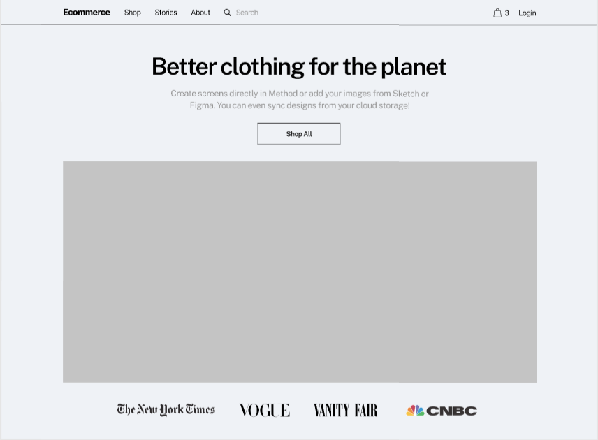
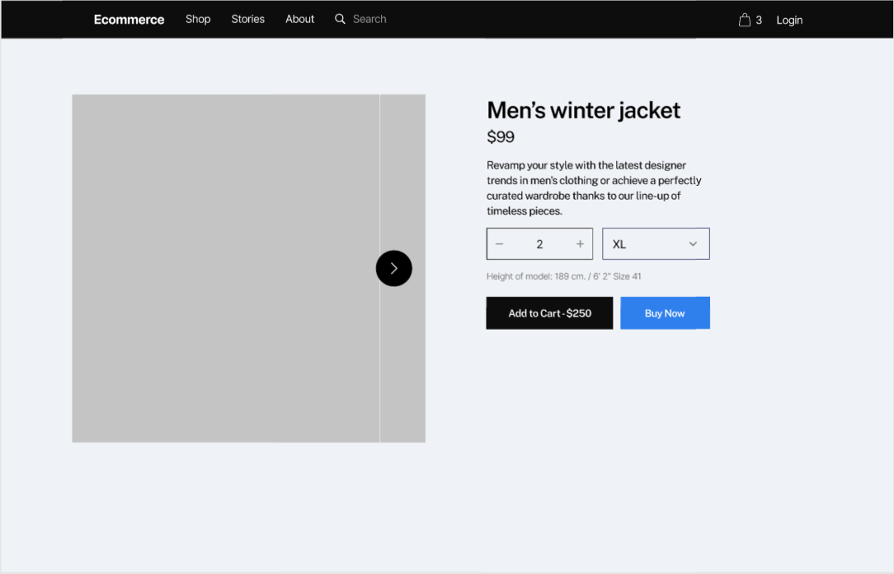
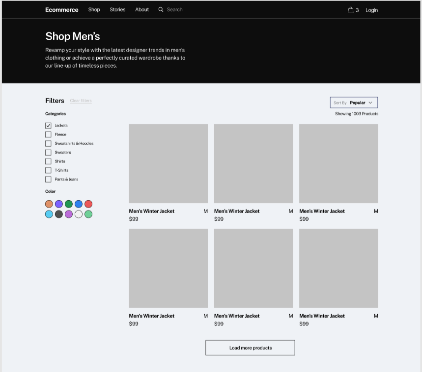
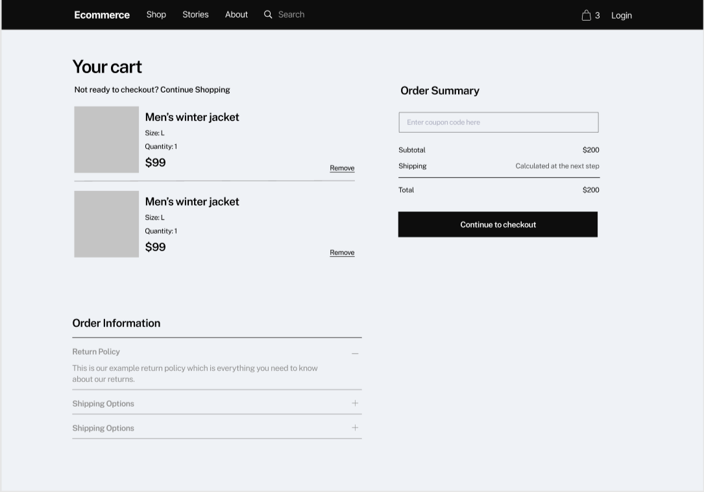

# ecommerce-projet S1B
*Réalisé une implémentation d'une maquette **Figma** en HTML/CSS (sans Librairie/Framework) **cf img***

* Mehmet-Emin IKITAS : Page d'accueil Hero 01
  
* Chahid YASSINE : Product Page 02
  
* Maxime Kosak : Shop Page
  
* Lucas LAURET : cart01.html
  
   
https://www.figma.com/file/YS88fIlPDDfvdcwiBBas1w/Ecommerce-Wireframe?node-id=0%3A1
